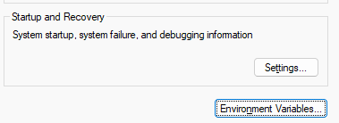
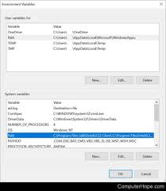
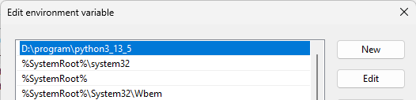

# Config Environment

## Config
- First of All: https://www.python.org/downloads/ (download python, here!)
- Config Environment on window: 
```cmd
C:\Windows\system32\rundll32.exe" sysdm.cpl,EditEnvironmentVariables 
```
Or Open window and search: `Edit environment variables `
- and then: open `environment variables...`

- Choose path: 
- Get python folder path: `C:\Python310`
- paste here: 
- OK OK and Apply

### Check
Open cmd
```commandline
python --version
```

__Result:__
```text
Python 3.13.5
```

- it's oke
- you can check more

```commandline
C:\Users\ADMIN>python
Python 3.13.5 (tags/v3.13.5:6cb20a2, Jun 11 2025, 16:15:46) [MSC v.1943 64 bit (AMD64)] on win32
Type "help", "copyright", "credits" or "license" for more information.
>>> print("hello")
hello
```